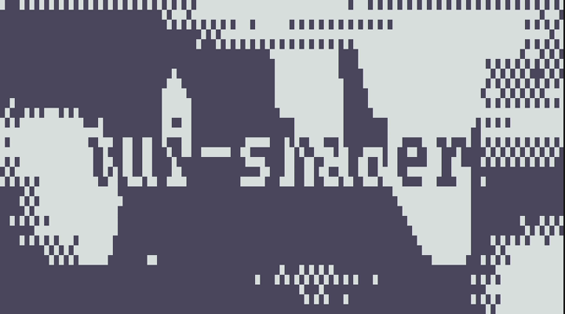
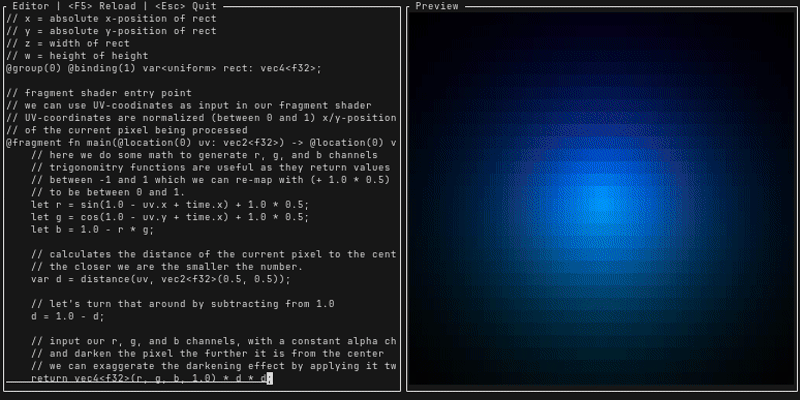

<p align="center">
  <a href="https://github.com/pemattern/tui-shader"></a>
</p>

## What is tui-shader?

`tui-shader` provides the `ShaderCanvas` `StatefulWidget` for the `ratatui` crate allowing us to harness the power of GPU shaders to make our terminals a more beautiful place.

> **Warning**
> This crate is still very early in development, please expect: bugs, major breaking changes, lack of documentation, poor API design, lots of other terrible things.  

## Shadertuiy

<p align="center">
  <a href="https:://github.com/pemattern/tui-shader"></a>
</p>

The example `shadertuiy` (like shadertoy, get it?) gives an example of a wgsl shader that can be used in `tui-shader` and let's one play around with shaders by quickly previewing
the result.

## Examples

<p align="center">
  <a href="https://github.com/pemattern/tui-shader"></a>
</p>

For the sake of simplicity, most examples run for a few seconds, and then quit.
To run examples use the following command:

```
cargo run --example=<name-of-example>
```
